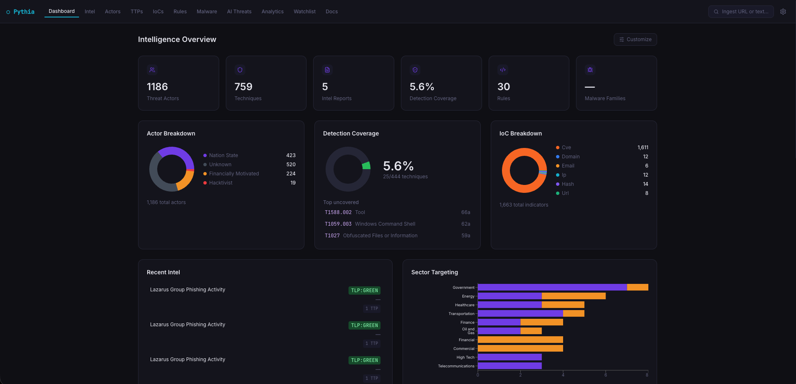

<div align="center">

```
 _____  __   __ _______ _    _ _____          
|  __ \ \ \ / /|__   __| |  | |_   _|   /\   
| |__) | \ V /    | |  | |__| | | |    /  \  
|  ___/   | |     | |  |  __  | | |   / /\ \ 
| |       | |     | |  | |  | |_| |_ / ____ \
 |_|       |_|     |_|  |_|  |_|_____/_/    \_\
```

**Oracle-grade threat intelligence, served as an API.**

[](https://python.org)
[](https://fastapi.tiangolo.com)
[](https://sqlalchemy.org)
[](https://anthropic.com)
[](LICENSE)

</div>

---

Named after the high priestess of Delphi who delivered Apollo's prophecies, **Pythia** ingests raw threat intelligence, normalizes it against industry frameworks, and delivers it through a clean REST API — including executive-ready PDF briefs a CFO can actually read.

It ships **fully loaded from the first clone**: over 1,180 threat actor profiles, 759 MITRE ATT&CK techniques, 1,600+ known-exploited CVEs, and 16 curated Sigma detection rules (plus 14 Yara) — no scraping required, no account sign-ups, no SaaS subscriptions.

---



---

## What It Does

```
Blog post / vendor report / OSINT
          │
          ▼ POST /v1/parse
    ┌─────────────┐
    │  Claude AI  │  ← extracts actors, TTPs, IoCs, CVEs,
    │   Parser    │     kill chain phases, business impact
    └─────┬───────┘
          │
          ▼ stored in SQLite
    ┌─────────────────────────────────────────────┐
    │              Pythia Database                │
    │  1,184 actors  ·  759 techniques  ·  1,600+ CVEs  │
    │  Kill Chain mapping  ·  Diamond Model views      │
    └─────┬───────────────────────────────────────┘
          │
    ┌─────┴────────────────────────────┐
    │         REST API  /v1/           │
    ├──────────────────────────────────┤
    │  /actors     threat actor profiles + TTPs   │
    │  /ttps       ATT&CK + ATLAS techniques      │
    │  /iocs       indicators of compromise       │
    │  /rules      Sigma detection rules          │
    │  /threats    ingested intel reports         │
    │  /reports    PDF generation                 │
    │  /parse      Claude extraction endpoint     │
    └─────┬────────────────────────────┘
          │
    ┌─────┴──────────────────┐
    │  Executive PDF Brief   │  Kill chain grid · financial exposure
    │  Tactical PDF Report   │  Full TTP table · IoC list · Admiralty
    └────────────────────────┘
```

---

## Bundled Intelligence

A fresh clone is **immediately useful** — no setup beyond configuration.

| Dataset | Source | Records |
|---|---|---|
| Threat actor profiles | MISP Galaxy + ATT&CK + APT Groups Sheet (merged) | **1,184** |
| ATT&CK techniques | MITRE ATT&CK STIX 2.1 — Enterprise + Mobile + ICS | **759** |
| Known-exploited CVEs | CISA KEV catalog | **1,602** |
| AI/ML adversarial techniques | MITRE ATLAS | full catalog |
| Sigma detection rules | Curated SigmaHQ subset | **16** |

Refresh from upstream any time:

```bash
pythia sync                          # refresh all sources
pythia sync attck misp-galaxy kev   # selective refresh
```

---

## Frameworks Integrated

| Framework | Purpose in Pythia |
|---|---|
| **MITRE ATT&CK** (Enterprise, Mobile, ICS) | Technique taxonomy, group-to-TTP mappings, tactic classification |
| **Lockheed Martin Cyber Kill Chain** | 7-phase attack lifecycle — ATT&CK tactics mapped to Kill Chain phases |
| **Diamond Model** | Adversary / Capability / Infrastructure / Victim view per actor |
| **MITRE ATLAS** | AI/ML adversarial techniques — model inversion, prompt injection, poisoning |
| **OWASP LLM Top 10 (2025)** | LLM-specific weaknesses extracted from ingested reports |
| **Pyramid of Pain** | IoC tier classification — hash → IP → domain → artifact → tools → TTPs |
| **NATO Admiralty Code** | Source reliability (A–F) × information credibility (1–6) on every IoC |
| **TLP** | WHITE / GREEN / AMBER / RED marking on every record |
| **STIX 2.1** | Native data model for actors, techniques, and relationships |

---

## Quick Start

### Docker (recommended)

```bash
# 1. Clone
git clone https://github.com/tyrenker/Pythia-CTI.git
cd pythia

# 2. Configure
cp .env.example .env
# Set ANTHROPIC_API_KEY to enable the Claude parser
# Set PYTHIA_API_KEY to a strong random string for write endpoint auth

# 3. Start
docker compose up --build
```

The first start auto-seeds the database (~60 seconds). After that, the API is live at `http://localhost:8000`.

> **Data persistence** — all ingested intel and threat reports are stored in `./db/pythia.db` on your host machine. Stopping, restarting, or rebuilding the container never deletes your data.

### Running the CLI via Docker (Recommended) 🐳

Because WeasyPrint (the library powering Pythia's PDF compiler) depends on system-level C shared libraries (`pango`, `cairo`, `harfbuzz`, etc.), running PDF generation directly on bare-metal macOS or Windows can sometimes be challenging due to missing dependencies. 

The **Docker container** comes pre-packaged with all system dependencies and Python modules configured out-of-the-box. 

#### Direct Docker Execution
To run any Pythia command inside the container, simply prefix it with `docker exec`:
```bash
# List ingested threat reports in your database
docker exec -it pythia pythia list threats

# Parse a new article URL and ingest it
docker exec -it pythia pythia ingest "https://www.huntress.com/blog/the-gentlemen-ransomware-defense-evasion-ttps"

# Generate a beautiful executive PDF brief
docker exec -it pythia pythia report "c881d693" --template executive --output data/gentlemen_executive.pdf
```

#### Setting up a local CLI Alias (Best of Both Worlds) 🚀
To make Pythia feel completely native and run commands simply by typing `pythia <command>` from anywhere in your host terminal, configure a shell alias:

1. **For Zsh (default on macOS):**
   ```bash
   echo "alias pythia='docker exec -it pythia pythia'" >> ~/.zshrc && source ~/.zshrc
   ```

2. **For Bash (Linux):**
   ```bash
   echo "alias pythia='docker exec -it pythia pythia'" >> ~/.bashrc && source ~/.bashrc
   ```

Now you can run clean CLI commands directly on your host machine from any directory:
```bash
pythia list threats
pythia report "c881d693" --template executive --output data/executive_brief.pdf
```
*(All generated PDFs are written to the `./data` folder, which is bind-mounted directly to your host machine's filesystem!)*

### Local (no Docker)

```bash
python3.11 -m venv .venv && source .venv/bin/activate
pip install -e ".[dev]"
pythia init-db
pythia sync          # seed from public sources (~60s)
pythia serve --reload
```

---

## Loading Synthetic Data (For UI Demos & Bug Testing)

If you are developing the UI frontend or running local demonstrations, you can populate the database with a comprehensive, realistic, and fully interconnected set of synthetic cyber threat intelligence (CTI) records.

This synthetic dataset populates **every single database table** with highly visual content, ensuring that all frontend stat cards, Diamond models, actor Kill Chain grids, recent feeds, and analytics pages are non-empty and visually rich.

### How to Run

Activate your virtual environment and run the script from the root directory:

```bash
# 1. Populate the database (safely skips existing synthetic data)
PYTHONPATH=src python3 scripts/load_synthetic_data.py

# 2. Wipe and reload the synthetic data from scratch (idempotent reset)
PYTHONPATH=src python3 scripts/load_synthetic_data.py --reset

# 3. Dry-run (lists what would be inserted without writing)
PYTHONPATH=src python3 scripts/load_synthetic_data.py --dry-run
```

The script operates in under **1 second** on local SQLite databases and uses deterministic UUID mappings so repeat runs are safely ignored.

---

## API Examples

**Health check**
```bash
curl http://localhost:8000/v1/health
# {"status":"ok","version":"0.1.0"}
```

**Look up a threat actor**
```bash
curl http://localhost:8000/v1/actors/APT28
```
```json
{
  "id": "...",
  "name": "APT28",
  "aliases": ["Fancy Bear", "STRONTIUM", "Sofacy", "Pawn Storm"],
  "country_code": "RU",
  "sponsor_type": "nation-state",
  "attck_group_id": "G0007",
  "ttps": [...]
}
```

**Kill Chain breakdown for an actor**
```bash
curl http://localhost:8000/v1/actors/APT28/killchain
```
```json
{
  "actor_name": "APT28",
  "phases": {
    "delivery":        [{"technique_id": "T1566", "name": "Phishing", ...}],
    "exploitation":    [{"technique_id": "T1059", "name": "Command and Scripting Interpreter", ...}],
    "installation":    [...],
    "command-and-control": [...],
    "actions-on-objectives": [...]
  }
}
```

**Diamond Model view**
```bash
curl http://localhost:8000/v1/actors/APT28/diamond
```
```json
{
  "adversary":      {"name": "APT28", "country": "RU", "sponsor_type": "nation-state"},
  "capability":     {"technique_count": 71, "sample_techniques": ["T1566", "T1059", ...]},
  "infrastructure": {"patterns": null, "known_tool_techniques": []},
  "victim":         {"sectors": [], "geographies": ["RU"]}
}
```

**Ingest a threat intelligence article**
```bash
curl -X POST http://localhost:8000/v1/parse \
  -H "Content-Type: application/json" \
  -d '{"url": "https://example.com/threat-report"}'
```
```json
{
  "report_id": "a3f2...",
  "title": "New Lazarus Group Campaign Targets Finance Sector",
  "tlp": "GREEN",
  "status": "pending_review",
  "parsed_data": {
    "actors": [{"name": "Lazarus Group", "confidence": "B2"}],
    "ttps": [{"technique_id": "T1566.001", "evidence": "...exact quote..."}],
    "iocs": [{"type": "domain", "value": "malicious.example.com", "context": "..."}],
    "killchain_phases": ["delivery", "exploitation", "actions-on-objectives"],
    "business_impact_draft": {
      "financial_range_usd": [500000, 5000000],
      "operational": "Potential 2–5 day recovery window for affected systems",
      "recommended_board_actions": [
        "Activate incident response retainer",
        "Notify cyber insurance carrier",
        "Brief legal counsel on regulatory notification timelines"
      ]
    }
  }
}
```

**Download an executive PDF brief**
```bash
curl "http://localhost:8000/v1/reports/{report_id}/pdf?template=executive" \
  --output brief.pdf
```

**Browse Sigma detection rules**
```bash
curl "http://localhost:8000/v1/rules?rule_type=sigma&technique_id=T1059&severity=high"
```

---

## Core Workflows & Use Cases

Pythia is designed to handle three core cyber threat intelligence (CTI) and security workflows:

### Workflow A: The C-Suite Executive Briefing 👔
* **Goal:** You find a highly technical threat report or ransomware analysis blog post and need to translate it into a visual, high-level summary that outlines financial risks and recommended strategic decisions for board members or C-level executives.
* **The Process:**
  1. **Ingest the raw OSINT blog post:**
     ```bash
     pythia ingest "https://www.huntress.com/blog/the-gentlemen-ransomware-defense-evasion-ttps"
     ```
  2. **Retrieve the short report ID:**
     ```bash
     pythia list threats
     ```
  3. **Compile the Executive PDF Brief:**
     ```bash
     pythia report "c881d693" --template executive --output data/exec_brief_gentlemen.pdf
     ```
* **What you get:** An A4 PDF containing an executive summary narrative, a Lockheed Martin Cyber Kill Chain coverage matrix, targeted sectors/countries, and a checklist of **Recommended Board Actions** (financial exposure range, operational downtime, and regulatory exposures under frameworks like GDPR/HIPAA).

### Workflow B: Forensics & Threat Hunting (SecOps) 🔍
* **Goal:** Analyze an ongoing cyber intrusion, extract all operational Indicators of Compromise (IoCs) tagged with confidence ratings, and generate high-fidelity Sigma detection rules for your SIEM.
* **The Process:**
  1. **Scrape and analyze the intrusion post:**
     ```bash
     pythia ingest "https://www.huntress.com/blog/slashandgrab-the-connectwise-screenconnect-vulnerability-explained-2"
     ```
  2. **Render a Tactical Analysis Report:**
     ```bash
     pythia report "4f7cbb25" --template tactical --output data/tactical_report.pdf
     ```
* **What you get:** A detailed tactical PDF detailing:
  * Comprehensive lists of observed **MITRE ATT&CK Techniques** with direct code/log evidence.
  * A full table of extracted **IoCs** (IPs, domains, hashes) classified by the **Pyramid of Pain** and verified using the **NATO Admiralty Code** for source reliability.
  * High-fidelity **Sigma and Yara rules** generated by Claude to detect the specific intrusion commands in your SIEM or EDR logs.

### Workflow C: Threat Actor Profiling & Gap Analysis 📊
* **Goal:** Research a specific threat actor (e.g., APT28) off-line, view their Diamond Model profile, and map their active techniques to standard threat lifecycles to locate defense coverage gaps.
* **The Process:**
  1. **Query actor profiles locally:**
     ```bash
     pythia list actors "APT28"
     ```
  2. **View TTP lifecycle mappings via the API:**
     ```bash
     curl http://localhost:8000/v1/actors/APT28/killchain
     ```
* **What you get:** A complete profile of the actor, their known nation-state affiliations, geographical targets, their **Diamond Model** (Adversary/Infrastructure/Capability/Victim), and their historical TTPs organized chronologically to let your security engineers build preemptive log coverage.

---

## CLI

```bash
pythia version                                  # version + ASCII logo
pythia serve [--host HOST] [--port PORT]        # start API server
pythia sync [sources...]                        # refresh bundled intel
pythia init-db                                  # create/migrate tables

pythia list actors                              # table of all actors
pythia list actors "Lazarus Group"              # detail view for one actor
pythia list actors --json                       # raw JSON output
pythia list actors --output actors.json         # write to file

pythia list threats                             # ingested intel reports
pythia list threats <report-id>                 # detail view for one report
```

---

## Architecture

```
src/pythia/
├── api/
│   ├── actors.py      # /v1/actors — profiles, killchain, diamond, diff
│   ├── ttps.py        # /v1/ttps  — ATT&CK + ATLAS technique lookup
│   ├── iocs.py        # /v1/iocs  — indicator search + filtering
│   ├── rules.py       # /v1/rules — Sigma/Yara detection rules
│   ├── threats.py     # /v1/threats — ingested report feed
│   ├── reports.py     # /v1/reports/{id}/pdf — PDF generation
│   └── parse.py       # /v1/parse — Claude extraction endpoint
│
├── core/
│   ├── config.py      # pydantic-settings, PYTHIA_* env vars
│   ├── db.py          # SQLAlchemy engine + session (WAL mode, FK enforcement)
│   └── seed.py        # MISP Galaxy, ATT&CK STIX, CISA KEV, ATLAS, Sigma pipeline
│
├── models/            # SQLAlchemy ORM — ThreatActor, AttckTechnique, IoC,
│                      #                  DetectionRule, SourceReport
│
├── ingestion/
│   ├── claude_parser.py        # Anthropic SDK → structured JSON
│   ├── prompts/extract_intel.md  # system prompt with JSON schema
│   └── scrapers/               # trafilatura-based URL fetcher
│
└── reporting/
    ├── pdf.py                  # Jinja2 + WeasyPrint renderer
    └── templates/
        ├── base.html           # shared layout, CSS, header/footer
        ├── executive.html      # C-suite: kill chain grid, financial impact
        └── tactical.html       # analyst: full TTP table, IoCs, Admiralty

data/
├── sigma/             # 16 curated Sigma rules (committed to repo)
└── seed/              # upstream license attribution

db/
└── pythia.db          # SQLite — bind-mounted in Docker, gitignored
```

---

## Deployment

Pythia is **self-hosted, single-analyst**. There is no managed instance, no public URL, no SaaS tier.

| Scenario | Command |
|---|---|
| Local dev | `pythia serve --reload` |
| Docker (persistent) | `docker compose up -d` |
| Selective sync | `pythia sync attck sigma` |
| Backup your data | `cp db/pythia.db ~/backups/` |

The server binds to `127.0.0.1:8000` by default. To expose on your LAN, set `PYTHIA_HOST=0.0.0.0` in `.env`.

---

## Configuration

Copy `.env.example` to `.env` and configure:

| Variable | Default | Description |
|---|---|---|
| `ANTHROPIC_API_KEY` | — | Required for `POST /v1/parse` (Claude extraction) |
| `PYTHIA_API_KEY` | `changeme` | Auth header for write endpoints |
| `PYTHIA_DATABASE_URL` | `sqlite:///./pythia.db` | SQLAlchemy database URL |
| `PYTHIA_CLAUDE_MODEL` | `claude-sonnet-4-6` | Claude model for intel extraction |
| `PYTHIA_HOST` | `127.0.0.1` | Bind address |
| `PYTHIA_PORT` | `8000` | Bind port |

---

## Interactive Docs

When the server is running, full OpenAPI documentation is available at:

- **`http://localhost:8000/docs`** — Swagger UI (try endpoints in the browser)
- **`http://localhost:8000/redoc`** — ReDoc (cleaner reading format)

---

## Data Sources & Licenses

| Source | License | Used For |
|---|---|---|
| [MISP Galaxy](https://github.com/MISP/misp-galaxy) | CC BY-SA 4.0 | Threat actor profiles |
| [MITRE ATT&CK](https://attack.mitre.org) | ATT&CK Terms of Use | Techniques, groups, TTP mappings |
| [MITRE ATLAS](https://atlas.mitre.org) | CC BY 4.0 | AI/ML adversarial techniques |
| [CISA KEV](https://www.cisa.gov/known-exploited-vulnerabilities-catalog) | Public Domain | Known-exploited CVEs |
| [SigmaHQ](https://github.com/SigmaHQ/sigma) | DRL 1.1 | Detection rules |

Full attribution in [`data/seed/SOURCES.md`](data/seed/SOURCES.md).

**Code license:** MIT. Bundled data carries its upstream license.

---

## Tests

> Activate your virtualenv first (`source .venv/bin/activate`), or prefix with `.venv/bin/`.

```bash
pytest                      # run all 13 tests
pytest -v                   # verbose — shows each test name
pytest tests/test_api.py    # endpoint tests only
```

---

<div align="center">

Built by [Ty Renker](https://github.com/tyrenker) · MIT License

*"She spoke. Empires listened."*

</div>
