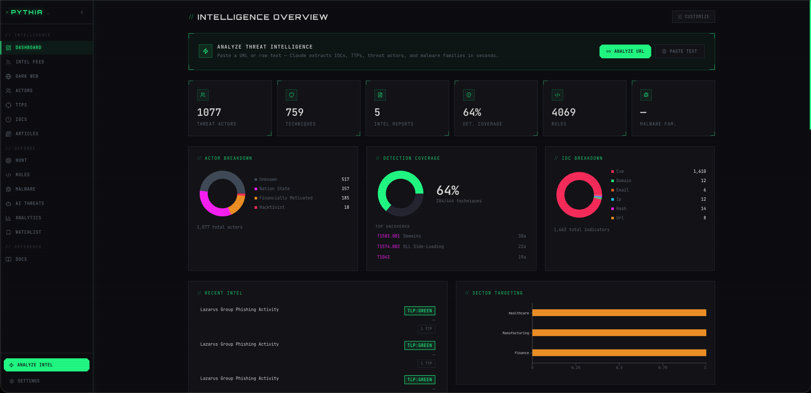

<div align="center">


[](https://python.org)
[](https://fastapi.tiangolo.com)
[](https://sqlalchemy.org)
[](https://anthropic.com)
[](LICENSE)

</div>

---

Named after the high priestess of Delphi who delivered Apollo's prophecies, **Pythia** ingests raw threat intelligence, normalizes it against industry frameworks, and delivers it through a clean REST API — including executive-ready PDF briefs a CFO can actually read.

It ships **fully loaded from the first clone**: over 1,180 threat actor profiles, 759 MITRE ATT&CK techniques, 1,600+ known-exploited CVEs, and 16 curated Sigma detection rules (plus 14 Yara) — no scraping required, no account sign-ups, no SaaS subscriptions.

It also operates as a **live collection platform**: deploy a Cowrie SSH honeypot alongside Pythia and real attacker events flow in automatically — enriched with GeoIP, ASN, AbuseIPDB, and GreyNoise data, clustered into named campaigns, and converted into Sigma rules that deploy directly to your SIEM (Wazuh, Splunk, or Elastic). When a rule fires, the alert lands back in Pythia's Operations queue, correlated to the originating campaign and ready to triage.

---



---

## What It Does

```
Blog post / vendor report / OSINT / Honeypot events
          │
          ├─ POST /v1/parse ──────────────────────────────┐
          │                                               │
          │  ┌─────────────┐                              │
          │  │  Claude AI  │  ← extracts actors, TTPs,   │
          │  │   Parser    │     IoCs, CVEs, kill chain   │
          │  └─────┬───────┘                              │
          │        │                                      │
          ├─ POST /v1/honeypot/events/bulk ───────────────┤
               Cowrie/T-Pot → forwarder → enrichment
                        │
                        ▼ stored in SQLite
    ┌─────────────────────────────────────────────────────┐
    │                  Pythia Database                    │
    │  1,184 actors · 759 techniques · 1,600+ CVEs        │
    │  Kill Chain mapping · Diamond Model views           │
    │  Honeypot events · Campaigns · SIEM alerts          │
    └─────┬───────────────────────────────────────────────┘
          │
    ┌─────┴────────────────────────────────┐
    │            REST API  /v1/            │
    ├──────────────────────────────────────┤
    │  /actors       threat actor profiles + TTPs         │
    │  /ttps         ATT&CK + ATLAS techniques            │
    │  /iocs         indicators of compromise             │
    │  /rules        Sigma/Yara detection rules           │
    │  /hunts        Threat hunt workbench & AI           │
    │  /threats      ingested intel reports               │
    │  /reports      PDF generation                       │
    │  /parse        Claude extraction endpoint           │
    │  /honeypot     live attack events, campaigns,       │
    │                blocklist, TAXII/STIX export,        │
    │                WebSocket real-time stream           │
    │  /siem         Wazuh/Splunk/Elastic rule deploy     │
    │                + alert triage queue                 │
    └─────┬────────────────────────────────┘
          │
    ┌─────┴──────────────────────────────────┐
    │  Executive PDF Brief                   │  Kill chain grid · financial exposure
    │  Tactical PDF Report                   │  Full TTP table · IoC list · Admiralty
    │  Honeypot Campaign Report              │  Attack timeline · credential patterns
    └────────────────────────────────────────┘
```

---

## Bundled Intelligence

A fresh clone is **immediately useful** — no setup beyond configuration.

| Dataset | Source | Records |
|---|---|---|
| Threat actor profiles | MISP Galaxy + ATT&CK + APT Groups Sheet (merged) | **1,184** |
| ATT&CK techniques | MITRE ATT&CK STIX 2.1 — Enterprise + Mobile + ICS | **759** |
| Known-exploited CVEs | CISA KEV catalog | **1,602** |
| AI/ML adversarial techniques | MITRE ATLAS | full catalog |
| Sigma detection rules | Curated SigmaHQ subset | **16** |

Refresh from upstream any time:

```bash
pythia sync                          # refresh all sources
pythia sync attck misp-galaxy kev   # selective refresh
```

---

## Frameworks Integrated

| Framework | Purpose in Pythia |
|---|---|
| **MITRE ATT&CK** (Enterprise, Mobile, ICS) | Technique taxonomy, group-to-TTP mappings, tactic classification |
| **Lockheed Martin Cyber Kill Chain** | 7-phase attack lifecycle — ATT&CK tactics mapped to Kill Chain phases |
| **Diamond Model** | Adversary / Capability / Infrastructure / Victim view per actor |
| **MITRE ATLAS** | AI/ML adversarial techniques — model inversion, prompt injection, poisoning |
| **OWASP LLM Top 10 (2025)** | LLM-specific weaknesses extracted from ingested reports |
| **Pyramid of Pain** | IoC tier classification — hash → IP → domain → artifact → tools → TTPs |
| **NATO Admiralty Code** | Source reliability (A–F) × information credibility (1–6) on every IoC |
| **TLP** | WHITE / GREEN / AMBER / RED marking on every record |
| **STIX 2.1** | Native data model for actors, techniques, relationships, and honeypot IOC bundles |

---

## Quick Start

### Docker (recommended)

```bash
# 1. Clone
git clone https://github.com/tyrenker/Pythia-CTI.git
cd pythia

# 2. Configure
cp .env.example .env
# Set ANTHROPIC_API_KEY to enable the Claude parser
# Set PYTHIA_API_KEY to a strong random string for write endpoint auth

# 3. Start
docker compose up --build
```

The first start auto-seeds the database (~60 seconds). After that, the API is live at `http://localhost:8000`.

> **Data persistence** — all ingested intel and threat reports are stored in `./db/pythia.db` on your host machine. Stopping, restarting, or rebuilding the container never deletes your data.

### Running the CLI via Docker (Recommended) 🐳

Because WeasyPrint (the library powering Pythia's PDF compiler) depends on system-level C shared libraries (`pango`, `cairo`, `harfbuzz`, etc.), running PDF generation directly on bare-metal macOS or Windows can sometimes be challenging due to missing dependencies.

The **Docker container** comes pre-packaged with all system dependencies and Python modules configured out-of-the-box.

#### Direct Docker Execution
To run any Pythia command inside the container, simply prefix it with `docker exec`:
```bash
# List ingested threat reports in your database
docker exec -it pythia pythia list threats

# Parse a new article URL and ingest it
docker exec -it pythia pythia ingest "https://www.huntress.com/blog/the-gentlemen-ransomware-defense-evasion-ttps"

# Generate a beautiful executive PDF brief
docker exec -it pythia pythia report "c881d693" --template executive --output data/gentlemen_executive.pdf
```

#### Setting up a local CLI Alias (Best of Both Worlds) 🚀
To make Pythia feel completely native and run commands simply by typing `pythia <command>` from anywhere in your host terminal, configure a shell alias:

1. **For Zsh (default on macOS):**
   ```bash
   echo "alias pythia='docker exec -it pythia pythia'" >> ~/.zshrc && source ~/.zshrc
   ```

2. **For Bash (Linux):**
   ```bash
   echo "alias pythia='docker exec -it pythia pythia'" >> ~/.bashrc && source ~/.bashrc
   ```

Now you can run clean CLI commands directly on your host machine from any directory:
```bash
pythia list threats
pythia report "c881d693" --template executive --output data/executive_brief.pdf
```
*(All generated PDFs are written to the `./data` folder, which is bind-mounted directly to your host machine's filesystem!)*

### Local (no Docker)

```bash
python3.11 -m venv .venv && source .venv/bin/activate
pip install -e ".[dev]"
pythia init-db
pythia sync          # seed from public sources (~60s)
pythia serve --reload
```

---

## Loading Synthetic Data (For UI Demos & Bug Testing)

If you are developing the UI frontend or running local demonstrations, you can populate the database with a comprehensive, realistic, and fully interconnected set of synthetic cyber threat intelligence (CTI) records.

This synthetic dataset populates **every single database table** with highly visual content, ensuring that all frontend stat cards, Diamond models, actor Kill Chain grids, recent feeds, and analytics pages are non-empty and visually rich.

### How to Run

Activate your virtual environment and run the script from the root directory:

```bash
# 1. Populate the database (safely skips existing synthetic data)
PYTHONPATH=src python3 scripts/load_synthetic_data.py

# 2. Wipe and reload the synthetic data from scratch (idempotent reset)
PYTHONPATH=src python3 scripts/load_synthetic_data.py --reset

# 3. Dry-run (lists what would be inserted without writing)
PYTHONPATH=src python3 scripts/load_synthetic_data.py --dry-run
```

The script operates in under **1 second** on local SQLite databases and uses deterministic UUID mappings so repeat runs are safely ignored.

---

## API Examples

**Health check**
```bash
curl http://localhost:8000/v1/health
# {"status":"ok","version":"0.1.0"}
```

**Look up a threat actor**
```bash
curl http://localhost:8000/v1/actors/APT28
```
```json
{
  "id": "...",
  "name": "APT28",
  "aliases": ["Fancy Bear", "STRONTIUM", "Sofacy", "Pawn Storm"],
  "country_code": "RU",
  "sponsor_type": "nation-state",
  "attck_group_id": "G0007",
  "ttps": [...]
}
```

**Kill Chain breakdown for an actor**
```bash
curl http://localhost:8000/v1/actors/APT28/killchain
```
```json
{
  "actor_name": "APT28",
  "phases": {
    "delivery":        [{"technique_id": "T1566", "name": "Phishing", ...}],
    "exploitation":    [{"technique_id": "T1059", "name": "Command and Scripting Interpreter", ...}],
    "installation":    [...],
    "command-and-control": [...],
    "actions-on-objectives": [...]
  }
}
```

**Diamond Model view**
```bash
curl http://localhost:8000/v1/actors/APT28/diamond
```
```json
{
  "adversary":      {"name": "APT28", "country": "RU", "sponsor_type": "nation-state"},
  "capability":     {"technique_count": 71, "sample_techniques": ["T1566", "T1059", ...]},
  "infrastructure": {"patterns": null, "known_tool_techniques": []},
  "victim":         {"sectors": [], "geographies": ["RU"]}
}
```

**Ingest a threat intelligence article**
```bash
curl -X POST http://localhost:8000/v1/parse \
  -H "Content-Type: application/json" \
  -d '{"url": "https://example.com/threat-report"}'
```
```json
{
  "report_id": "a3f2...",
  "title": "New Lazarus Group Campaign Targets Finance Sector",
  "tlp": "GREEN",
  "status": "pending_review",
  "parsed_data": {
    "actors": [{"name": "Lazarus Group", "confidence": "B2"}],
    "ttps": [{"technique_id": "T1566.001", "evidence": "...exact quote..."}],
    "iocs": [{"type": "domain", "value": "malicious.example.com", "context": "..."}],
    "killchain_phases": ["delivery", "exploitation", "actions-on-objectives"],
    "business_impact_draft": {
      "financial_range_usd": [500000, 5000000],
      "operational": "Potential 2–5 day recovery window for affected systems",
      "recommended_board_actions": [
        "Activate incident response retainer",
        "Notify cyber insurance carrier",
        "Brief legal counsel on regulatory notification timelines"
      ]
    }
  }
}
```

**Download an executive PDF brief**
```bash
curl "http://localhost:8000/v1/reports/{report_id}/pdf?template=executive" \
  --output brief.pdf
```

**Browse Sigma detection rules**
```bash
curl "http://localhost:8000/v1/rules?rule_type=sigma&technique_id=T1059&severity=high"
```

**Honeypot live feed**
```bash
# Ingest a Cowrie event (done automatically by the forwarder)
curl -X POST http://localhost:8000/v1/honeypot/events/bulk \
  -H "X-API-Key: your-key" \
  -H "Content-Type: application/json" \
  -d '[{"eventid":"cowrie.login.failed","src_ip":"1.2.3.4","username":"root","password":"admin","timestamp":"2026-06-20T12:00:00Z"}]'

# Fetch active campaigns
curl http://localhost:8000/v1/honeypot/campaigns?status=active

# Download IP blocklist (no auth required)
curl http://localhost:8000/v1/honeypot/feeds/blocklist.txt

# STIX 2.1 bundle of honeypot campaign IOCs
curl http://localhost:8000/v1/honeypot/taxii/honeypot-iocs

# Real-time event stream (WebSocket)
wscat -c ws://localhost:8000/v1/honeypot/stream
```

**SIEM status and rule deployment**
```bash
# Check SIEM connection
curl http://localhost:8000/v1/siem/status

# Deploy all active detection rules to your SIEM
curl -X POST http://localhost:8000/v1/siem/rules/deploy-all \
  -H "X-API-Key: your-key"

# List incoming SIEM alerts
curl "http://localhost:8000/v1/siem/alerts?triage_status=new"

# Triage an alert
curl -X PATCH http://localhost:8000/v1/siem/alerts/{id}/triage \
  -H "X-API-Key: your-key" \
  -H "Content-Type: application/json" \
  -d '{"triage_status":"true_positive","analyst_notes":"Confirmed Mirai botnet scanner","triaged_by":"analyst1"}'
```

---

## Core Workflows & Use Cases

### Workflow A: The C-Suite Executive Briefing 👔
* **Goal:** Translate a technical threat report into a visual, high-level summary with financial risks and recommended board actions.
* **The Process:**
  1. **Ingest the raw OSINT blog post:**
     ```bash
     pythia ingest "https://www.huntress.com/blog/the-gentlemen-ransomware-defense-evasion-ttps"
     ```
  2. **Retrieve the short report ID:**
     ```bash
     pythia list threats
     ```
  3. **Compile the Executive PDF Brief:**
     ```bash
     pythia report "c881d693" --template executive --output data/exec_brief_gentlemen.pdf
     ```
* **What you get:** An A4 PDF with executive summary narrative, a Lockheed Martin Cyber Kill Chain coverage matrix, targeted sectors/countries, and **Recommended Board Actions** (financial exposure range, operational downtime, regulatory exposures under GDPR/HIPAA).

### Workflow B: Forensics & Threat Hunting (SecOps) 🔍
* **Goal:** Analyze an intrusion, extract IoCs with confidence ratings, and generate high-fidelity Sigma rules for your SIEM.
* **The Process:**
  1. **Scrape and analyze the intrusion post:**
     ```bash
     pythia ingest "https://www.huntress.com/blog/slashandgrab-the-connectwise-screenconnect-vulnerability-explained-2"
     ```
  2. **Render a Tactical Analysis Report:**
     ```bash
     pythia report "4f7cbb25" --template tactical --output data/tactical_report.pdf
     ```
* **What you get:** MITRE ATT&CK techniques with code evidence, IoCs classified by Pyramid of Pain and Admiralty Code, and Sigma/Yara rules generated by Claude.

### Workflow C: Threat Actor Profiling & Gap Analysis 📊
* **Goal:** Research a specific threat actor, view their Diamond Model profile, and map TTPs to kill chain phases to locate defense coverage gaps.
* **The Process:**
  1. **Query actor profiles locally:**
     ```bash
     pythia list actors "APT28"
     ```
  2. **View TTP lifecycle mappings via the API:**
     ```bash
     curl http://localhost:8000/v1/actors/APT28/killchain
     ```
* **What you get:** A complete actor profile with nation-state affiliations, targets, Diamond Model, and historical TTPs organized by kill chain phase.

### Workflow D: Interactive Threat Hunt Workbench (SecOps) 🎯
* **Goal:** Launch a scoped threat hunt, log observations rated by Admiralty Code, use AI for actor attribution, and generate SIEM-ready detection rules.
* **The Process:**
  1. **Start a new Hunt Session** via the UI or API. Define a hypothesis, target sectors, and motivation focus.
  2. **Log observations:** Enter IPs, hashes, or ATT&CK techniques. The workbench maps them to Pyramid of Pain tiers and links to actor profiles.
  3. **Run AI actor suggestions:** Claude cross-references observations against 1,180+ actors for potential attribution matches.
  4. **Draft and promote detections:** Auto-draft Sigma/YARA/KQL rules and promote them to the global detections library with one click.

### Workflow E: Honeypot Collection & Campaign Analysis 🍯
* **Goal:** Deploy a Cowrie SSH honeypot, automatically enrich and cluster attacker events into campaigns, and generate actionable CTI from real internet traffic.
* **The Architecture:**
  ```
  Internet → Cowrie SSH Honeypot (VPS)
                   │ JSON log tail
                   ▼
          honeypot-forwarder → POST /v1/honeypot/events/bulk
                   │
                   ▼
          Pythia (GeoIP + ASN + AbuseIPDB + GreyNoise enrichment)
                   │
          Campaign clustering (every 15 min)
                   │
          Auto-generated Sigma rules + CTI reports
  ```
* **The Process:**
  1. **Start the honeypot stack:**
     ```bash
     docker compose -f docker-compose.yml -f docker-compose.honeypot.yml up -d
     ```
  2. **Monitor the live feed** on the **Honeypot** page in the UI — events appear within seconds.
  3. **View campaigns** — the scheduler clusters correlated attacker IPs into named campaigns (e.g., `CAMPAIGN-2026-001`).
  4. **Generate a campaign CTI report:**
     ```bash
     curl -X POST http://localhost:8000/v1/honeypot/campaigns/{id}/generate-report \
       -H "X-API-Key: your-key"
     ```
  5. **Export IOCs as STIX 2.1** for downstream tooling, or pull `/v1/honeypot/feeds/blocklist.txt` into your firewall.

  See [docs/honeypot-siem-setup.md](docs/honeypot-siem-setup.md) for VPS deployment instructions.

### Workflow F: SIEM Rule Deployment & Alert Triage 📡
* **Goal:** Push Pythia's detection rules to Wazuh, Splunk, or Elastic and triage SIEM alerts in a unified queue correlated to honeypot campaigns.
* **The Process:**
  1. **Configure your SIEM** in `.env` (see Configuration below).
  2. **Deploy all active rules** to the SIEM from the **Operations** page or via API.
  3. **Wazuh webhooks back** to `/v1/siem/alerts/receive` when a rule fires.
  4. **Triage alerts** from the Operations → Alert Queue UI, with automatic campaign correlation when the attacker IP matches a known campaign.

  See [docs/honeypot-siem-setup.md](docs/honeypot-siem-setup.md) for full Wazuh setup including the webhook integration script.

---

## CLI

```bash
pythia version                                  # version + ASCII logo
pythia serve [--host HOST] [--port PORT]        # start API server
pythia sync [sources...]                        # refresh bundled intel
pythia init-db                                  # create/migrate tables

pythia list actors                              # table of all actors
pythia list actors "Lazarus Group"              # detail view for one actor
pythia list actors --json                       # raw JSON output
pythia list actors --output actors.json         # write to file

pythia list threats                             # ingested intel reports
pythia list threats <report-id>                 # detail view for one report
```

---

## Architecture

```
src/pythia/
├── api/
│   ├── actors.py      # /v1/actors — profiles, killchain, diamond, diff
│   ├── ttps.py        # /v1/ttps  — ATT&CK + ATLAS technique lookup
│   ├── iocs.py        # /v1/iocs  — indicator search + filtering
│   ├── rules.py       # /v1/rules — Sigma/Yara detection rules
│   ├── threats.py     # /v1/threats — ingested report feed
│   ├── reports.py     # /v1/reports/{id}/pdf — PDF generation
│   ├── hunts.py       # /v1/hunts — Threat hunt workbench (AI-assisted)
│   ├── parse.py       # /v1/parse — Claude extraction endpoint
│   ├── honeypot.py    # /v1/honeypot — event ingest, campaigns, blocklist, TAXII, WebSocket
│   └── siem.py        # /v1/siem — rule deployment + alert triage
│
├── core/
│   ├── config.py      # pydantic-settings, PYTHIA_* env vars
│   ├── db.py          # SQLAlchemy engine + session (WAL mode, FK enforcement)
│   └── seed.py        # MISP Galaxy, ATT&CK STIX, CISA KEV, ATLAS, Sigma pipeline
│
├── models/
│   ├── actor.py       # ThreatActor
│   ├── attck.py       # AttckTechnique
│   ├── ioc.py         # IoC
│   ├── hunt.py        # HuntSession, HuntFinding
│   ├── rule.py        # DetectionRule (Sigma/Yara) + siem_rule_id, siem_deployed_at
│   ├── honeypot.py    # HoneypotEvent, HoneypotCampaign, SiemAlert
│   └── ...
│
├── ingestion/
│   ├── claude_parser.py          # Anthropic SDK → structured JSON
│   ├── honeypot_normalizer.py    # Cowrie / Dionaea / Honeytrap / Mailoney → HoneypotEvent
│   ├── honeypot_enricher.py      # GeoIP, ASN, AbuseIPDB, GreyNoise, VirusTotal
│   ├── cowrie_ttp_map.py         # map attacker shell commands → ATT&CK TTP IDs
│   ├── campaign_detector.py      # clustering job — groups events into campaigns
│   └── prompts/
│       ├── extract_intel.md
│       ├── hunt_suggest_actors.md
│       ├── hunt_refine_hypothesis.md
│       └── hunt_draft_detection.md
│
├── integrations/
│   └── siem/
│       ├── base.py     # SiemClient ABC
│       ├── wazuh.py    # Wazuh REST API client
│       ├── splunk.py   # Splunk REST API client
│       ├── elastic.py  # Elastic/OpenSearch client
│       └── factory.py  # get_siem_client() — reads PYTHIA_SIEM_TYPE
│
├── detections/
│   ├── converters.py        # Sigma → backend query format
│   └── honeypot_sigma.py    # auto-generate Sigma rules from campaign data
│
└── reporting/
    ├── pdf.py               # Jinja2 + WeasyPrint renderer
    ├── honeypot_report.py   # campaign CTI report generator
    └── templates/
        ├── base.html
        ├── executive.html
        ├── tactical.html
        └── honeypot_daily.html

docker/
├── cowrie/                  # Cowrie SSH honeypot config
└── honeypot-forwarder/      # log-tail agent that ships events to Pythia

data/
├── sigma/             # 16 curated Sigma rules (committed to repo)
└── seed/              # upstream license attribution

db/
└── pythia.db          # SQLite — bind-mounted in Docker, gitignored
```

---

## Deployment

Pythia is **self-hosted, single-analyst**. There is no managed instance, no public URL, no SaaS tier.

| Scenario | Command |
|---|---|
| Local dev | `pythia serve --reload` |
| Docker (persistent) | `docker compose up -d` |
| Docker + Honeypot | `docker compose -f docker-compose.yml -f docker-compose.honeypot.yml up -d` |
| Docker + SIEM (Wazuh) | `docker compose -f docker-compose.siem.yml up -d` |
| Selective sync | `pythia sync attck sigma` |
| Backup your data | `cp db/pythia.db ~/backups/` |

The server binds to `127.0.0.1:8000` by default. To expose on your LAN, set `PYTHIA_HOST=0.0.0.0` in `.env`.

For honeypot VPS deployment and SIEM webhook setup, see [docs/honeypot-siem-setup.md](docs/honeypot-siem-setup.md).

---

## Configuration

Copy `.env.example` to `.env` and configure:

### Core

| Variable | Default | Description |
|---|---|---|
| `ANTHROPIC_API_KEY` | — | Required for `POST /v1/parse` (Claude extraction) |
| `PYTHIA_API_KEY` | `changeme` | Auth header for write endpoints |
| `PYTHIA_DATABASE_URL` | `sqlite:///./pythia.db` | SQLAlchemy database URL |
| `PYTHIA_CLAUDE_MODEL` | `claude-sonnet-4-6` | Claude model for intel extraction |
| `PYTHIA_HOST` | `127.0.0.1` | Bind address |
| `PYTHIA_PORT` | `8000` | Bind port |

### Honeypot Collection

| Variable | Default | Description |
|---|---|---|
| `PYTHIA_HONEYPOT_INGEST_ENABLED` | `false` | Enable `/v1/honeypot` endpoints |
| `PYTHIA_ENABLE_SCHEDULER` | `false` | Run campaign detection + daily reports every 15 min |
| `ABUSEIPDB_API_KEY` | — | AbuseIPDB enrichment (free: 1,000 checks/day) |
| `GREYNOISE_API_KEY` | — | GreyNoise community enrichment (free) |
| `VIRUSTOTAL_API_KEY` | — | VirusTotal enrichment (free: 500 req/day) |
| `MAXMIND_DB_PATH` | — | Path to `GeoLite2-City.mmdb` (free download from MaxMind) |
| `MAXMIND_ASN_DB_PATH` | — | Path to `GeoLite2-ASN.mmdb` |

### SIEM Integration

| Variable | Default | Description |
|---|---|---|
| `PYTHIA_SIEM_TYPE` | — | `wazuh`, `splunk`, or `elastic` (blank = disabled) |
| `PYTHIA_SIEM_URL` | — | Base URL of the SIEM API |
| `PYTHIA_SIEM_USERNAME` | — | SIEM API username |
| `PYTHIA_SIEM_PASSWORD` | — | SIEM API password |
| `PYTHIA_SIEM_API_TOKEN` | — | API token (Elastic/OpenSearch only) |

---

## Interactive Docs

When the server is running, full OpenAPI documentation is available at:

- **`http://localhost:8000/docs`** — Swagger UI (try endpoints in the browser)
- **`http://localhost:8000/redoc`** — ReDoc (cleaner reading format)

---

## Data Sources & Licenses

| Source | License | Used For |
|---|---|---|
| [MISP Galaxy](https://github.com/MISP/misp-galaxy) | CC BY-SA 4.0 | Threat actor profiles |
| [MITRE ATT&CK](https://attack.mitre.org) | ATT&CK Terms of Use | Techniques, groups, TTP mappings |
| [MITRE ATLAS](https://atlas.mitre.org) | CC BY 4.0 | AI/ML adversarial techniques |
| [CISA KEV](https://www.cisa.gov/known-exploited-vulnerabilities-catalog) | Public Domain | Known-exploited CVEs |
| [SigmaHQ](https://github.com/SigmaHQ/sigma) | DRL 1.1 | Detection rules |

Full attribution in [`data/seed/SOURCES.md`](data/seed/SOURCES.md).

**Code license:** MIT. Bundled data carries its upstream license.

---

## Tests

> Activate your virtualenv first (`source .venv/bin/activate`), or prefix with `.venv/bin/`.

```bash
pytest                      # run all tests
pytest -v                   # verbose — shows each test name
pytest tests/test_api.py    # endpoint tests only
```

---

<div align="center">

Built by [Ty Renker](https://github.com/tyrenker) · MIT License

*"She spoke. Empires listened."*

</div>
